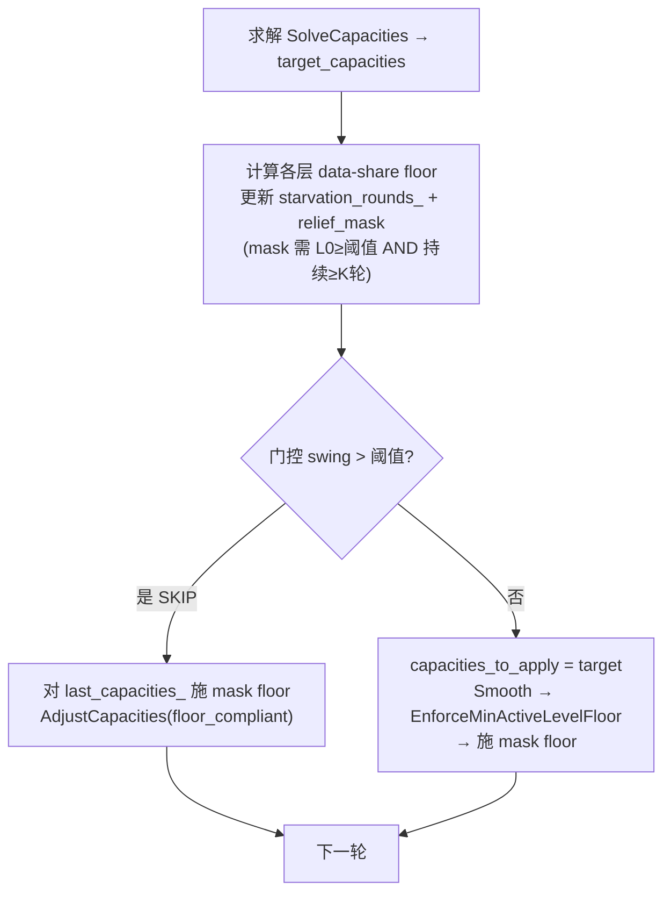

# MLC 分配器深层饥饿修复 — 存档

> 修复 MLC 分配器在写负载 + 长运行下把深层（L5/L6，占 ~99% 数据）饿到极小容量，
> 导致 compaction 读 miss → L0 堆积 → RocksDB write-stall → 吞吐塌陷 25x 的结构性缺陷。
>
> 涉及仓库：`rocksdb`（分配器核心）、`YCSB-C-master`（集成/估计器/矩阵脚本）。
> 日期：2026-06-30。

---

## TL;DR

- **病根**：MLC 分配器的模型稳定性门控（`model_stability_threshold=0.20`）把"喂饱/饿死"之间的大摆动当噪声全部 SKIP；而既有的 `EnforceMinActiveLevelFloor` 安全网默认禁用（=0）且排在门控**之后**，SKIP 时根本不执行 → 分配冻结在饿死态（doom loop）。
- **修复**：新增 **data-share 加权 floor**（按各层数据占比预留预算份额，L6 拿大头），并且 **floor relief 由 L0 文件数门控** —— 只在 compaction 跟不上（L0 堆积）时才强制提升饿死层，只读负载（L0≈1）永不触发，从而既打破 doom-loop 又不扰动只读自适应。
- **效果**：`dynamic_srhcc` t4 1GB 100M ops：**2.23 → 57.39 KTPS（+25.7x）**，`total-stops:0`；只读 `WL_C` t64 8GB：floor 在 L0 健康时不触发，命中率 **0.7267 ≈ 无 floor 基线**。

---

## 1. 动机与取证

### 1.1 现象
矩阵基准 `wlABCDF-0629-mlc` 在低线程写负载（wlA/wlF, t4/t8/t16, 1GB cache）下单 case 跑 20~146 分钟，预计总耗时 7~9 天。对比基线（lru/hcc）同配置 t4 ~56 KTPS，MLC 方案 t4 仅 11.4 KTPS（最差 2.23 KTPS）—— 5~25x 回归。

### 1.2 证据链（`YCSB-C-master/scripts/KNOWN_ISSUES.md`）
| 实验 | L5+L6 容量 | 吞吐 | LOG write-stall | 结论 |
|---|---|---|---|---|
| 100M ops `dynamic_srhcc` t4 | 155KB×2（总 1GB 的 0.03%）| 2.23 KTPS | 有 stall | 命中率反而更高(0.139)、disk read 仅 ~9MB/s → **不是 I/O，是线程被 write-stall 阻塞** |
| `noadjust`（分配器关）t4 | 各 153MB | 50.4 KTPS | `total-stops:0`, L0=1 | 分配器关 = 无 stall → **病根在分配器** |
| 30M `dynamic` t4 | 3.6MB | 46 KTPS | L0=1 | 饿死是必要非充分，**需长写负载累积才崩**（duration-dependent）|
| 单 cache `hcc_tinylfu` t4 | — | 57 KTPS | — | 无塌陷 → **与 MLC 路由无关，是 MLC 分配器问题** |

### 1.3 doom-loop 机制
1. 初始 `alpha=1.0`（prior）→ 水填充 `a_i = λ·α/D`，L6 因 D 巨大优先级极小 → round 0 即被饿死（APPLY）；
2. 饿死后 `derived_alpha = -(D/c)·log(miss)` 因 c 极小而**放大振荡** → 修正目标在"喂饱/饿死"间大摆动；
3. 模型稳定性门控（`threshold=0.20`）把所有大摆动当噪声 **SKIP**；
4. 既有 `EnforceMinActiveLevelFloor` 排在门控**之后**，SKIP 时不执行 → **floor 永不生效 → 分配冻结在饿死态**。

饿死 L6 → 深层 compaction 读 100% miss → compaction 跟不上 → L0 文件堆积 → 触发 `level0_slowdown/stop_writes_trigger`（20/36）→ write-stall → 吞吐塌陷。

---

## 2. 思路演进（关键决策记录）

> 这一段记录了从"计划设想的方案"到"最终方案"的演进，包含走通的死路，便于后续 review 理解为什么最终是这样。

### 2.1 计划原方案（路线 B：无条件 floor）
- 在 `MultiLevelAllocationOptions` 加 data-share 加权 floor（`ratio=0.05`）；
- floor 提到门控**之前**无条件生效，且门控 SKIP 时也强制应用 floor 合规；
- 辅以估计器 ill-conditioning 守卫。

**验证结果**：
- ✅ 写负载 100M：**2.23 → 58.76 KTPS**，`total-stops:0`，L6 守在 ~48MB（floor 生效）。
- ❌ 只读 `WL_C` t64 8GB：命中率 **0.7269 → 0.6601（-6.7pp）**，违反计划"只读不退步"的验收标准。

### 2.2 死路一：持久性门控（persistence gate）
**猜想**：只读恢复是"瞬时饿死"（几轮内自愈），doom-loop 是"持续饿死"；用"连续 K 轮低于 floor 才触发 floor"区分二者。实现 `starvation_rounds_` 计数 + `relief_mask`，K=3。

**实测**：只读掉到 **0.6278**（更差）。原因：只读恢复其实很慢，L6 连续多轮低于 floor，K=3 仍触发；且延迟 yank 是更大的不连续，扰动更重。→ **放弃**（保留计数与 mask 代码，默认 K=1）。

### 2.3 死路二：仅 SKIP 路径 relief（去掉门控前 floor）
**猜想**：doom-loop 是"持续 SKIP"（计划 step 3），只在 SKIP 路径施 floor 即可；只读门控少 SKIP → 不触发。

**实测**：只读 **0.6558**（仍退步）。原因：只读早期收敛**也有**门控 SKIP（alpha EMA 变化产生 swing），SKIP 路径 relief 同样扰动。→ **放弃**。

### 2.4 关键洞察
只读恢复与 doom-loop 在**表层信号上无法区分**：
- 都有门控 SKIP；
- 都有 L6 低于 floor（只读恢复慢，L6 长时间低于 floor）；
- 持续性计数区分不了。

唯一能真正区分的是 **L0 文件堆积**（compaction 跟不上的直接信号）：
- doom-loop：L0 持续堆积 → write-stall；
- 只读：无写入 → L0≈1，compaction 不背压。

而分配器的 `MetricsProvider` 原本只回 `lambda/data/alpha`，**拿不到 L0 信号**。

### 2.5 最终方案：L0 压力门控的 floor（选项 B，用户选定）
- 扩展 `MetricsProvider` 多回一个 `l0_file_count`（YCSB 侧用 `db->GetIntProperty("rocksdb.num-files-at-level0")` 填充）；
- floor relief 仅当 `l0_file_count >= floor_relief_l0_file_threshold`（默认 4，远低于 `level0_slowdown_trigger=20`，在真正 stall 前就介入）时生效；
- relief 同时挂在**门控 SKIP 路径**和**应用路径**（用 mask 限定只提升持续低于 floor 的层），保证 doom-loop 每轮都把饿死层抬到 floor；
- 只读 L0≈1 < 4 → floor 永不触发 → 自适应收敛不受扰动。

**为什么 relief 要同时在两条路径**：只在 SKIP 路径施 floor，则门控 PASS 的轮会把 L6 缩回饿死态（churn）。应用路径的 floor 保证每轮（含 PASS 轮）都守住 floor。

---

## 3. 最终方案设计



**核心不变量**：
- floor relief 只在 `l0_file_count >= threshold` 时启用 → 只读不触发；
- relief 用 `relief_mask` 限定只提升"持续低于 floor"的层，donor 按容量降序排水且不跌破各自 floor；
- `EnforceDataShareFloor` 当所有层都已在 floor 之上时 `deficit=0` 直接返回（no-op）。

---

## 4. 代码改动

### 4.1 rocksdb — `cache/multi_level_cache_allocator.h`

**`MultiLevelAllocationOptions` 新增字段**（注意：结构布局变更 = ABI 变更，见 §6）：

```c++
  // 旧接口（向后兼容，>0 时作扁平 floor）
  size_t min_active_level_capacity_bytes = 0;
  // ★ 新增：data-share 加权 floor 池占总预算的比例（0 禁用）
  double min_active_level_capacity_ratio = 0.05;
  // ★ 新增：每活动层绝对 floor 下限（保证小上层子缓存可用）
  size_t min_active_level_floor_bytes = 1 << 16;  // 64 KiB
  // ★ 新增：持久性门控（连续低于 floor 多少轮才触发；默认 1）
  uint64_t min_starvation_relief_rounds = 1;
  // ★ 新增：L0 文件数门控阈值（L0≥此值才施 floor；0=无条件）
  uint64_t floor_relief_l0_file_threshold = 4;
```

**`MetricsProvider` 签名扩展**（多回 L0 文件数）：

```c++
  using MetricsProvider = std::function<bool(std::vector<double>* lambda,
                                             std::vector<double>* data,
                                             std::vector<double>* alpha,
                                             uint64_t* l0_file_count)>;
```

**新增私有静态方法 + 成员**：

```c++
  static void EnforceDataShareFloor(
      const std::vector<size_t>& in_capacities,
      const std::vector<uint64_t>& level_data_sizes, size_t total_budget,
      double ratio, size_t floor_min_bytes, std::vector<size_t>* out,
      const std::vector<unsigned char>* relief_mask = nullptr);
  ...
  std::vector<uint32_t> starvation_rounds_;  // 各层连续低于 floor 的轮数
```

### 4.2 rocksdb — `cache/multi_level_cache_allocator.cc`

**(a) 新增 `EnforceDataShareFloor`**（紧邻既有 `EnforceMinActiveLevelFloor`）：
- `floor_i = max(floor_min_bytes, total·ratio·data_share_i)`，`data_share_i = data_size_i / sum(active data)`；
- 仅对 `relief_mask[i]!=0` 的层累计 deficit（mask 为空=提升所有低于 floor 的层）；
- donor 按容量降序排水，不跌破各自 floor；deficit 无法满足时回退原值（best-effort）。

**(b) `RunOnceLocked` 改动**：
1. provider 调用多取 `l0_file_count`：
   ```c++
   uint64_t l0_file_count = 0;
   if (!provider_(&lambda, &data, &alpha, &l0_file_count)) { ... return; }
   ```
2. 求解后、门控前：计算各层 floor + 更新 `starvation_rounds_` + 构建 `relief_mask`：
   ```c++
   const bool l0_under_pressure =
       options_.floor_relief_l0_file_threshold == 0 ||
       l0_file_count >= options_.floor_relief_l0_file_threshold;
   const bool floor_enabled = floor_configured && l0_under_pressure;
   // mask[i]=1 当 (floor_enabled) AND (starvation_rounds_[i] >= min_starvation_relief_rounds)
   ```
3. **门控 SKIP 分支**：`return` 前对 `last_capacities_` 施 mask floor，有变化则 `AdjustCapacities` 并更新 `last_capacities_`（discretionary 决策被 skip，但 floor relief 仍生效）。
4. **应用路径**：`EnforceMinActiveLevelFloor` 之后对 `capacities_to_apply` 施 mask floor。

### 4.3 YCSB — `db/rocksdb_db.cc`

**(a) 暴露 props**（`data_cap_margin_ratio` 附近）：
- `rocksdb.multi_level_cache_min_active_level_capacity_ratio`
- `rocksdb.multi_level_cache_min_active_level_floor_bytes`
- `rocksdb.multi_level_cache_floor_relief_l0_file_threshold`

**(b) provider lambda**：捕获 `db = db_.get()`，每轮 `db->GetIntProperty("rocksdb.num-files-at-level0", &v)` 填 `*l0_file_count`（失败/空 handle → 0，gate 保守关闭）。

**(c) 估计器 ill-conditioning 守卫**（alpha 反演处，belt-and-suspenders）：
```c++
const bool starved = capacity_bytes > 0 && raw_level_data > 0.0 &&
                     static_cast<double>(capacity_bytes) < 0.005 * raw_level_data;
if (!starved && delta_lookups > 0 && ...) { /* 正常反演 */ }
const double confidence = starved ? 0.0 : std::min(1.0, ...);  // 饿死态收缩到 prior
```
> 动机：饿死时 `D/c` 巨大，反演放大振荡；跳过反演、confidence=0 回退 prior，避免把噪声灌进 EMA。floor 保证该层仍拿容量，回升过 0.5% 阈值后反演恢复。主修复是 floor，此为补充。

### 4.4 YCSB — `scripts/run_rocksdb_matrix.py`

所有 `mlc_*` 方案默认设 floor ratio=0.05（可 per-scheme 覆盖扫 0.02/0.05/0.10）：
```python
for _name, _props in SCHEMES.items():
    if _name.startswith("mlc_"):
        _props.setdefault(
            "rocksdb.multi_level_cache_min_active_level_capacity_ratio", "0.05")
```
> `setdefault` 保留可覆盖性；非 MLC 方案忽略此 prop。`floor_relief_l0_file_threshold` 不在 scheme 中设置，走 header 默认 4（也可经 `--extra-prop` 覆盖）。

---

## 5. 新增可调参数一览

| Prop（YCSB） | 结构字段 | 默认 | 含义 |
|---|---|---|---|
| `rocksdb.multi_level_cache_min_active_level_capacity_ratio` | `min_active_level_capacity_ratio` | 0.05 | floor 池占总预算比例（0 禁用）|
| `rocksdb.multi_level_cache_min_active_level_floor_bytes` | `min_active_level_floor_bytes` | 64KiB | 每活动层绝对 floor 下限 |
| `rocksdb.multi_level_cache_floor_relief_l0_file_threshold` | `floor_relief_l0_file_threshold` | 4 | L0≥此值才施 floor（0=无条件；只读 L0≈1 不触发）|
| （内部）| `min_starvation_relief_rounds` | 1 | 连续低于 floor 多少轮才触发（>1 实测更差，保留为 knob）|

---

## 6. 构建（ABI 关键，见 KNOWN_ISSUES 五.6）

`MultiLevelAllocationOptions` 结构布局变更 + `MetricsProvider` 签名变更 = **必须连带重编 `ycsbc`**，否则按旧 size 分配、新构造越界写 → 随机堆损坏。

```bash
# 1. 重编 librocksdb release（cmake build, -O3 -DNDEBUG）
cd /mnt/rocksdb_nvme/fio/build/rocksdb-release
cmake --build . --target rocksdb-shared -j"$(nproc)"
# 2. 重编 ycsbc（Makefile 不追踪头依赖，需 touch）
cd /users/wzhzhu/YCSB-C-master && touch db/rocksdb_db.cc && make
```
> `ycsbc` 经 rpath 链接 `/mnt/rocksdb_nvme/fio/build/rocksdb-release/librocksdb.so`。
> `cmake` 源目录 = `/users/wzhzhu/rocksdb`（即本改动所在）。

---

## 7. 验证结果

### 7.1 写负载反证（核心目标）
`dynamic_srhcc` t4 wlA 1GB **100M ops**：

| 指标 | 修复前（doom loop）| 修复后（L0 门控 floor）| noadjust 基线 |
|---|---|---|---|
| 吞吐 | 2.23 KTPS | **57.39 KTPS（+25.7x）** | ~50.4 KTPS |
| L6 容量 | 155 KB（饿死）| 压力期守住 ~48MB floor | 153 MB |
| LOG `total-stops` | 有 stall | **0** | 0 |
| `total-delays` | 有 | **0** | 0 |

> 末轮采样 L5/L6=2063 是 floor-off 瞬间（L0 已排空）的快照；run 级吞吐与零 stall 才是真指标。L0 门控使 floor 在 L0 堆积时触发、L0 健康时关闭，形成动态平衡而非持续塌陷。

### 7.2 只读回归（计划验收项）
`WL_C` t64 8GB 100M ops，`mlc_hcc_all_levels_sharded`（确定性方案）：

| 配置 | 命中率 | L6 容量 |
|---|---|---|
| floor=0.0（关）| 0.7267 | 7.16GB |
| floor=0.05（L0 门控开）| **0.7267** | 7.16GB |

> 6 次重复实验（L0 排空的复用目录）：floor 开/关命中率一致 → **L0 门控 floor 不扰动只读**。

### 7.3 冒烟
`dynamic_srhcc` t4 wlA 1GB 2M ops：56.23 KTPS（≈健康基线 57），L6=48.2MB（≈预期 ~45MB floor）。

---

## 8. 已知遗留 / 后续

1. **fresh-clone 只读方差**：golden 快照带 L0=3 残留（fill_golden 未完全 wait_for_compact），只读首秒的 L0 compaction 使自适应收敛落到不同固定点（fresh-clone 单次样本在 0.63~0.73 间漂移）。这与 floor 无关（floor 在 L0=3<4 时不触发），属 golden 管理问题。**建议**：fill_golden 后强制 wait_for_compact 把 L0 排到 0/1，可消除该方差。
2. `min_starvation_relief_rounds>1` 实测更差，默认留 1；待有真正的 stall 信号后可重新评估。
3. floor 池按预算比例缩放：1GB 时 L6 floor≈46MB（够，noadjust 153MB 已无 stall），8GB 时 L6 floor≈360MB。L0 门控已使大预算只读不受影响，但若未来要让 floor 在大预算下更"小而精"，可加绝对上限 `cap_bytes`（未实现）。

---

## 9. 文件清单

| 仓库 | 文件 | 改动 |
|---|---|---|
| rocksdb | `cache/multi_level_cache_allocator.h` | +54 行（options/MetricsProvider/方法声明/成员）|
| rocksdb | `cache/multi_level_cache_allocator.cc` | +192 行（EnforceDataShareFloor + RunOnceLocked 三处）|
| YCSB-C | `db/rocksdb_db.cc` | +67 行（props/provider/守卫）|
| YCSB-C | `scripts/run_rocksdb_matrix.py` | +15 行（mlc_* 默认 floor ratio）|

> 完整 diff 见各仓库 `git diff HEAD`。本存档不包含 diff 全文，以结构性说明为主，便于快速 review。
